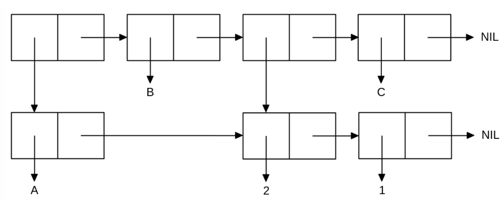

<p align="center"><b>МОНУ НТУУ КПІ ім. Ігоря Сікорського ФПМ СПіСКС</b></p>
<p align="center">
<b>Звіт з лабораторної роботи 1</b><br/>
"Обробка списків з використанням базових функцій"<br/>
дисципліни "Вступ до функціонального програмування"
</p>

<p align="right"><b>Студент(-ка)</b>: <i>Коротич Олександр Сергійович КВ-11</i><p>
<p align="right"><b>Рік</b>: <i>2024</i><p>

## Хід виконання роботи:

## Загальне завдання:

### 1. Створіть список з п'яти елементів, використовуючи функції LIST і CONS . Форма створення списку має бути одна — використання SET чи SETQ (або інших допоміжних форм) для збереження проміжних значень не допускається. Загальна кількість елементів (включно з підсписками та їх елементами) не має перевищувати 10-12 шт. (дуже великий список робити не потрібно). Збережіть створений список у якусь змінну з SET або SETQ . Список має містити (напряму або у підсписках): хоча б один символ, хоча б одне число, хоча б один не пустий підсписок, хоча б один пустий підсписок:
```lisp
(defparameter my-list '())
(setq my-list (list 1 #\A (cons 2 3) '(4 5) '()))
```
```
0] (load "lab1.lisp")
List: (1 A (2 . 3) (4 5) NIL)
```
### 2. Отримайте голову списку:
```lisp
(format t "Head of the list: ~A~%" (first my-list))
```
```
Head of the list: 1
```
### 3. Отримайте хвіст списку.
```lisp
(format t "Tail of the list: ~A~%" (cdr my-list))
```
```
Tail of the list: (A (2 . 3) (4 5) NIL)
```
### 4. Отримайте третій елемент списку.
```lisp
(format t "Third element of the list: ~A~%" (third my-list))
```
```
Third element of the list: (2 . 3)
```
### 5. Отримайте останній елемент списку.
```lisp
(format t "Last item in the list: ~A~%" (car (last my-list)))
```
```
Last item in the list: NIL
```
### 6. Використайте предикати ATOM та LISTP на різних елементах списку (по 2-3 приклади для кожної функції).
```lisp
(format t "Is the first element an atom? ~A~%" (atom (first my-list)))
(format t "Is the third element an atom? ~A~%" (atom (second my-list)))
(format t "Is the fourth element a list? ~A~%" (listp (first my-list)))
(format t "Is the fifth element a list? ~A~%" (listp (third my-list)))
```
```
Is the first element an atom? T
Is the third element an atom? T
Is the fourth element a list? NIL
Is the fifth element a list? T
```
### 7. Використайте на елементах списку 2-3 інших предикати з розглянутих у розділі 4 навчального посібника.
```lisp
(format t "Is the second element a character? ~A~%" (characterp (second my-list)))
(format t "Is the first element a number? ~A~%" (numberp (first my-list)))
(format t "Is the fifth element null? ~A~%" (null (fifth my-list)))
```
```
Is the second element a character? T
Is the first element a number? T
Is the fifth element null? T
```
### 8. Об'єднайте створений список з одним із його непустих підсписків. Для цього використайте функцію APPEND 
```lisp
(format t "Merged list: ~A~%" (append my-list (fourth my-list)))
```
```
Merged list: (1 A (2 . 3) (4 5) NIL 4 5)
```
## Варіант 2
<p align="center">

</p>

```lisp
;; Define lists
(defparameter sub_list '())
(defparameter lab_task_list '())
;; Set them
(setq sub_list (list "A" 2 1))
(setq lab_task_list (list sub_list "B" (cdr sub_list) "C"))

(format t "Main list: ~A~%" lab_task_list)
(format t "Sub list: ~A~%" sub_list)

(setf (second sub_list) 99)
(format t "Main list after changing sub list: ~A~%" lab_task_list)
```
```
Main list: ((A 2 1) B (2 1) C)
Sub list: (A 2 1)
Main list after changing sub list: ((A 99 1) B (99 1) C)
```